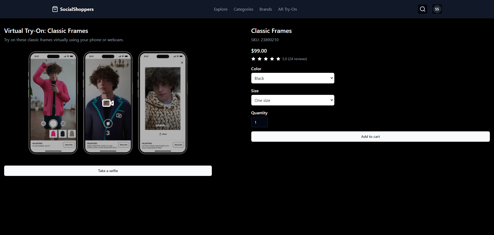

# SocialShoppers

This repository contains the website for SocialShoppers, a project developed for the BLG442E course on innovation and technical management for information technology.

## Description

SocialShoppers is an innovative platform that aims to revolutionize the way people shop online. It provides a unique social shopping experience by allowing users to connect with their friends, share product recommendations, and make informed purchasing decisions. The platform leverages the power of social networks to create a more engaging and personalized shopping experience for users. It also utilizes advanced machine learning algorithms to provide personalized product recommendations based on user preferences and shopping behavior. Furthermore it solves the problem of cloth fitting using AR technology.

## Interface

